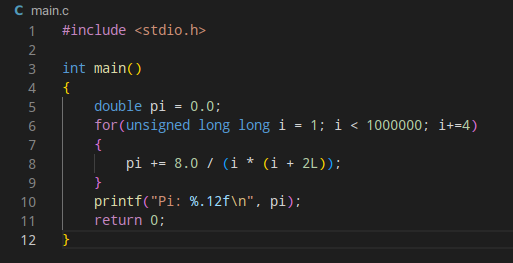
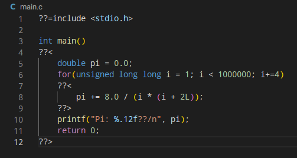

# Trigraphify
Convert your C code into code containing trigraphs

## Screenshots
### Before

### After

## How to use
Simply run `python main.py -i <input> -o <output>`. For example, `python main.py -i main.c -o main.c`.

When compiling with tripgrahs you must use the compiler flag `-trigraphs`. For example `gcc main.c -o main -trigraphs`.